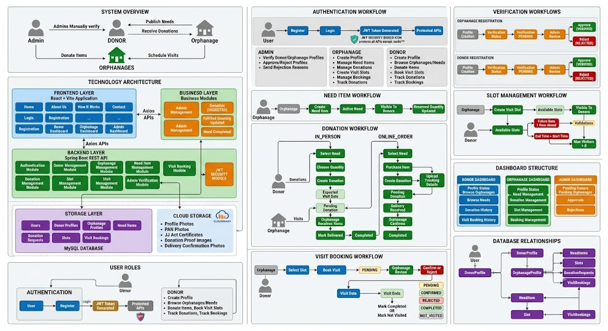

# CareBridge – Need-Driven Donation & Visit Scheduling Platform

<!-- ===================================================== -->
<!-- PROJECT BANNER / SCREENSHOT -->
<!-- Replace with your application screenshot -->
<!-- ===================================================== -->

<p align="center">
  
</p>

<p align="center">
  Connecting verified donors and orphanages through transparent, need-based donations and structured visit scheduling.
</p>

---

## Overview

CareBridge is a need-driven donation and visit scheduling platform that connects verified donors with verified orphanages through a transparent and structured ecosystem.

The platform enables orphanages to publish their actual requirements, receive targeted donations, manage visitor appointments, and track fulfillment progress. Donors can discover verified orphanages, contribute directly to active needs, schedule visits, and monitor the impact of their contributions.

CareBridge aims to improve transparency, accountability, and efficiency in charitable giving by ensuring donations are aligned with real-world requirements.

---

## Problem Statement

Many individuals are willing to support orphanages but often face challenges such as:

- Limited visibility into actual requirements
- Difficulty identifying verified organizations
- Lack of transparency in donation utilization
- Unstructured donation processes
- No organized system for scheduling visits

CareBridge addresses these challenges by creating a centralized platform where verified orphanages and donors can interact through a transparent and accountable process.

---

## Key Features

### Authentication & Access Control

- Secure user authentication
- Role-based access management
- Protected application workflows
- Profile verification process
- Controlled access to platform features

---

### Donor Features

- User registration and login
- Donor profile management
- Browse verified orphanages
- Search and filter orphanages
- View active requirements
- Create donations based on actual needs
- Track donation status
- Schedule orphanage visits
- View booking history
- Manage personal profile information

---

### Orphanage Features

- Orphanage registration and login
- Orphanage profile management
- Publish and manage requirements
- Track requirement fulfillment
- Manage donation requests
- Create visit slots
- Manage visitor bookings
- Approve or reject visit requests
- Monitor donation activity
- Maintain operational transparency

---

### Donation Management

- Need-based donation system
- Requirement-driven contributions
- Donation tracking
- Donation status management
- Fulfillment monitoring
- Delivery confirmation workflows
- Donation history management

---

### Visit Scheduling System

- Structured visit slot creation
- Visitor booking management
- Booking approval workflows
- Visit confirmation process
- Visit completion tracking
- Organized visitor scheduling

---

### Administrative Features

- Review donor profiles
- Review orphanage profiles
- Approve registrations
- Reject registrations with reasons
- Maintain platform integrity
- Manage verification workflows

---

## Platform Workflow

### Donor Journey

```text
Register
    ↓
Create Profile
    ↓
Verification
    ↓
Browse Orphanages
    ↓
View Active Needs
    ↓
Donate or Schedule Visit
    ↓
Track Progress
```

### Orphanage Journey

```text
Register
    ↓
Create Profile
    ↓
Verification
    ↓
Publish Requirements
    ↓
Receive Donations
    ↓
Manage Visitors
    ↓
Track Fulfillment
```

### Administrative Workflow

```text
Profile Review
      ↓
Approve or Reject
      ↓
Maintain Platform Trust
```

---

## Core Modules

### Authentication Module

Handles registration, login, access control, and user authorization.

### Profile Management Module

Supports donor and orphanage profile creation, management, and verification.

### Requirement Management Module

Allows orphanages to create, update, and manage requirements while tracking fulfillment.

### Donation Management Module

Facilitates donations, donation tracking, delivery confirmation, and progress monitoring.

### Visit Scheduling Module

Enables orphanages to create visit slots and donors to schedule visits through a structured workflow.

### Administrative Module

Supports profile verification, approvals, rejections, and overall platform governance.

---

## Platform Highlights

- Need-driven donation ecosystem
- Transparent contribution process
- Verified participant network
- Structured visit scheduling
- End-to-end donation tracking
- Role-based access control
- Responsive user interface
- Scalable architecture
- Centralized management system

---


## Design Principles

CareBridge is designed around the following principles:

- Transparency
- Accountability
- Simplicity
- Accessibility
- Trust
- Scalability
- User-Centered Design

The platform provides a consistent experience across desktop, tablet, and mobile devices.

---

## Vision

CareBridge seeks to create a transparent and efficient ecosystem where donors can directly support verified needs while orphanages can effectively manage donations and visitor interactions.

The platform promotes meaningful contributions, stronger community engagement, and greater trust between donors and organizations working to support children in need.

---

## Future Scope

Potential future enhancements include:

- Advanced analytics dashboards
- Donation impact reporting
- Notification systems
- AI-powered requirement recommendations
- Enhanced search and discovery
- Mobile applications
- Multi-language support
- Community engagement features

---

## License

This project is intended for educational, research, and social-impact purposes.

---

<p align="center">
  CareBridge – Connecting Needs with Generosity Through Transparency and Trust.
</p>